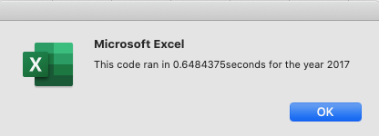
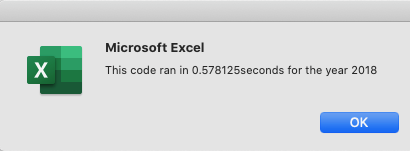
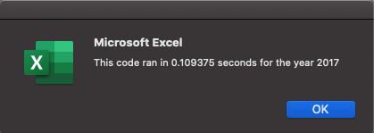
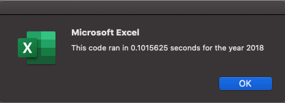

# Stock Analysis with VBA

## Project Overview

The goal of this project is to refactor VBA code that analyzes annual stock performance in the green energy sector. The client requested a quick and simple way to analyze annual stock performance in order to make informed decisions about investment, which was best accomplished using Excel VBA. The main refactoring goal is to make the code run faster and more efficiently by combining seperate blocks of code to run in one subroutine. Another refactoring goal is to increase the code's performance capability by running an analysis on multiple stocks simultaneously. Refactoring this code provides a reusable subroutine that can handle large amounts of stock market data and produce critical information on stock performance for any year with decreased runtime. 

## Results

### Stock Performance
When comparing the stock performance of selected green energy companies in 2017 and 2018, it became evident that these companies performed better in 2017. For example, the 12 client-selected companies showed an average of a 67.3% increase in returns with only one company showing a decrease in returns in 2017. In contrast, the same 12 companies showed a collective decrease of 8.5% in returns with only two companies showing increased returns in 2018. 

### Refactoring
In the context of refactoring the preexisting code, steps 5 through 8 (below) were the areas where code was changed to run faster. The most impactful change to the original code was creating a ticker index variable, which could be used to keep track of the tickers when looping through rows and columns. Creating this ticker index variable ensured that the loops would accurately grab the correct data for each ticker while optimizing the coding process. Further, the original code was broken up into several different subroutines, which made running the code slow and inefficient. Creating one subroutine that did the job of several created faster runtimes, and was therefore an effective method for creating better VBA code. The only downside to refactoring this code into one subroutine is the inability to break up sections of the code into seperate buttons for ease of client use. Figure 1 shows the runtime for the code before refactoring, and Figure 2 shows the runtime for the code after refactoring.

### Figure 1



### Figure 2
 

Below is a step by step breakdown of the code used for analyzing this stock data with Excel VBA.

### Step 1
*Create Subroutine for refactoring code*
```
Sub AllStocksAnalysisRefactored()
```
### Step 2
*Define runtime variables, create input box for year selection, begin timer*
```
    Dim startTime As Single
    Dim endTime  As Single

    yearValue = InputBox("What year would you like to run the analysis on?")

    startTime = Timer
```
### Step 3
*Select output sheet, create headers*
```
    Worksheets("All Stocks Analysis").Activate
    
    Range("A1").Value = "All Stocks (" + yearValue + ")"
    
    Cells(3, 1).Value = "Ticker"
    Cells(3, 2).Value = "Total Daily Volume"
    Cells(3, 3).Value = "Return"
```
### Step 4
*Initialize array of tickers*
```
    Dim tickers(11) As String
    
    tickers(0) = "AY"
    tickers(1) = "CSIQ"
    tickers(2) = "DQ"
    tickers(3) = "ENPH"
    tickers(4) = "FSLR"
    tickers(5) = "HASI"
    tickers(6) = "JKS"
    tickers(7) = "RUN"
    tickers(8) = "SEDG"
    tickers(9) = "SPWR"
    tickers(10) = "TERP"
    tickers(11) = "VSLR"
```
### Step 5
*Activate data worksheet, get number of rows to loop over, create ticker index and initialize to zero, create three output arrays*
```
    Worksheets(yearValue).Activate
    
    RowCount = Cells(Rows.Count, "A").End(xlUp).Row
    
    'RowCount code taken from https://stackoverflow.com/questions/25056372/vba-range-row-count/25056498
    
    Dim tickerIndex As Integer
    tickerIndex = 0
    
    Dim tickerVolumes(11) As Long
    Dim tickerStartingPrices(11) As Single
    Dim tickerEndingPrices(11) As Single
```
### Step 6
*Use for loop to initalize ticker volumes to zero*
```
    For i = 0 To 11
    
        tickerVolumes(i) = 0
    
    Next i
```
### Step 7
*Increase volume for current ticker, check if current row is the first row for ticker, check if current row is last row for ticker, increae ticker index*
```
    For i = 2 To RowCount
            
        tickerVolumes(tickerIndex) = tickerVolumes(tickerIndex) + Cells(i, 8).Value
        
          If Cells(i - 1, 1).Value <> tickers(tickerIndex) Then
            
            tickerStartingPrices(tickerIndex) = Cells(i, 6).Value
            
          End If
          
          If Cells(i + 1, 1).Value <> tickers(tickerIndex) Then
        
            tickerEndingPrices(tickerIndex) = Cells(i, 6).Value
            
        End If
        
        If Cells(i + 1, 1).Value <> tickers(tickerIndex) Then
        
            tickerIndex = tickerIndex + 1
        
        End If
                
    Next i
```
### Step 8
*Loop through output arrays to find ticker, total daily volume, and returns*
```
    For i = 0 To 11
        
        Worksheets("All Stocks Analysis").Activate
        Cells(4 + i, 1).Value = tickers(i)
        Cells(4 + i, 2).Value = tickerVolumes(i)
        Cells(4 + i, 3).Value = tickerEndingPrices(i) / tickerStartingPrices(i) - 1
        
    Next i
```
### Step 9
*Format cell font and style, color return increases in green and return decreases in red, end timer and show runtime, end subroutine*
```
    Worksheets("All Stocks Analysis").Activate
    Range("A3:C3").Font.FontStyle = "Bold"
    Range("A3:C3").Borders(xlEdgeBottom).LineStyle = xlContinuous
    Range("B4:B15").NumberFormat = "#,##0"
    Range("C4:C15").NumberFormat = "0.0%"
    Columns("B").AutoFit

    dataRowStart = 4
    dataRowEnd = 15

    For i = dataRowStart To dataRowEnd
        
        If Cells(i, 3) > 0 Then
            
            Cells(i, 3).Interior.Color = vbGreen
            
        Else
        
            Cells(i, 3).Interior.Color = vbRed
            
        End If
        
    Next i
 
    endTime = Timer
    MsgBox "This code ran in " & (endTime - startTime) & " seconds for the year " & (yearValue)

End Sub
```
